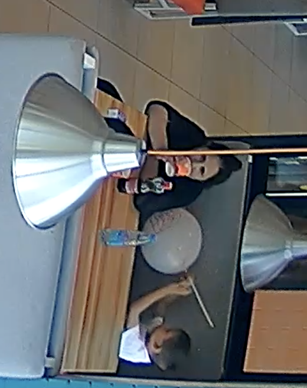

# Скрипт для анализа занятости столиков по видео


## Какая логика использовалась для детекции событий

### Гибридный подход детекции
1. **Детекция движения** — область стола разбивается на сетку 3×3 ячеек. Если минимум в 2 ячейках движение превышает заданный порог, фиксируется активность.
2. **YOLOv8** — каждые 2 кадра модель детектирует людей в ROI стола. Обнаруженный человек подтверждает активность.

### Логика определения событий
- **Посадка**: активность фиксируется непрерывно в течение `stabilization_time` секунд
- **Уход**: отсутствие активности в течение `no_motion_timeout` секунд

### Цвет выделенного стола
Скрипт анализирует видео с камеры наблюдения и детектирует события у столиков:
- **Зеленый контур** — стол свободен
- **Желтый контур** — обнаружена активность
- **Красный контур** — стол занят


## Как запустить проект

### Требования
- Python 3.11.15

### Шаги установки
```bash
# 1. Клонируйте репозиторий
git clone https://github.com/y-mal/dodo_pizza_test.git
cd dodo_pizza_test

# 2. Создайте виртуальное окружение
python3 -m venv venv
source venv/bin/activate  # Linux/Mac
# или
venv\Scripts\activate  # Windows

# 3. Установите зависимости
pip install -r requirements.txt

# 4. Запустите скрипт с указанием источника
python main.py --video test_video.mp4

# 5. Выделение области и запуск анализа
Выделите 4-5 точек на видео и нажмите дважды ENTER
```


## Какое видео и какой столик были выбраны

### Были обработаны все видео из примера:
- На **video_1** и **video_3** были выбраны ближайшие столы к камере.
- На **video_2** был выбран дальний столик справа для демонстрации логики просчета среднего времени между клиентами.


## Полученный результат (среднее время задержки для выбранного видео)

- На **video_2** среднее время задержки между клиентами 208 секунд / 3.5 минут (всего 2 клиента)

#### Стол #1: посадок 2, освобождений 2
   1. Посадка: 00:00:00с → Уход: 00:01:48с (длительность: 108с)
   2. Посадка: 00:05:16с → Уход: 00:07:46с (длительность: 150с)


## Пример проблемного кадра (скриншот)

#### Проблемными кадрами являются места, где плохо видно лица клиентов, плохое качество видео или есть обьекты, которые мешают YOLO стабильно распознавать человека, например:

- Фрагмент из video_3:
